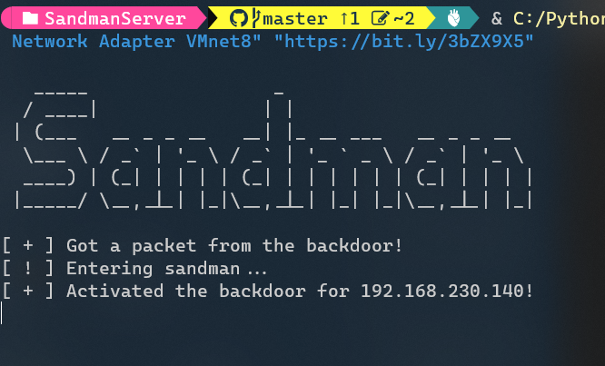

# Sandman

  

Sandman is a backdoor that meant to work on hardened networks during red team engagements.

Sandman works as a stager and leverages NTP (protocol to sync time & date) to download an arbitrary shellcode from a pre defined server.

Since NTP is a protocol that is overlooked by many defenders resulting wide network accessability.

## Usage



### SandmanServer (Usage)

Run on windows / *nix machine:

```sh
python3 sandman_server.py "<Network Adapter>" "Payload Url"
```

### SandmanBackdoor (Usage)

To start, you can compile the SandmanBackdoor as [mentioned below](#setup), with csc and run it in your favorite way on the compromised machine.

The server can run on windows / *nix machines if the [requirements](/SandmanServer/requirements.txt) installed.

## Limitations

- Currently, the project does not have ip spoofing capabilities (will be changed in the next version).

- A NTP packet must be in size of 48 bytes, therefore you will need to shorten your url or send it in 2 packets, you can use a url shortener like bit.ly (might add support for longer url in the next version).

## Setup

### SandmanServer (Setup)

- Python 3.9
- Requiremenets specified in the [requirements](/SandmanServer/requirements.txt) file.

### SandmanBackdoor (Setup)

To create this project I used Visual Studio 2022, but as mentioned in the [usage section](#usage) it can be compiled with both VS2022 and csc.

## IOCs

- A shellcode is injected to RuntimeBroker.

- Suspicious NTP communication, starts with known magic header.

## Contributions

I'll happily accept contribution, make a pull request and I will review it!
